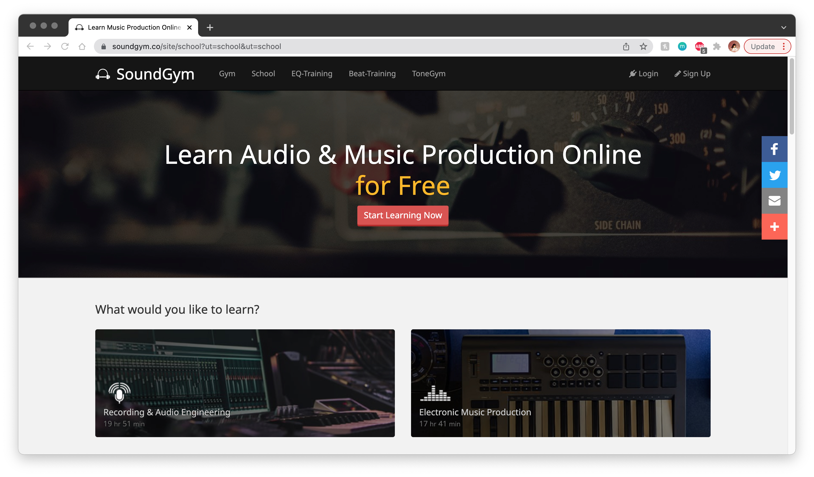
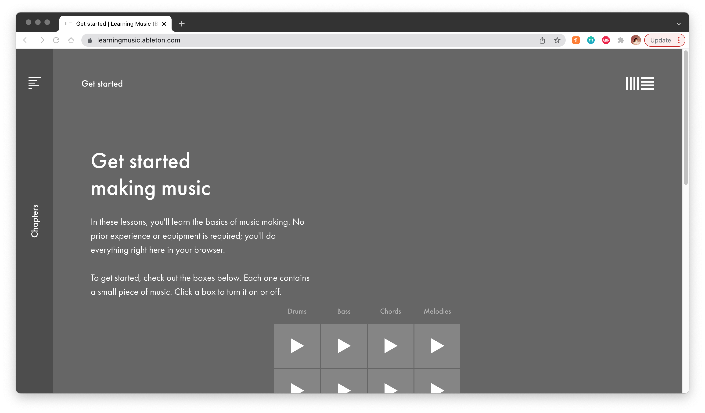

#### Assignment 01: Heuristic Evaluation
# Music Production through Web-Based Learning
Daisy Kwok | DH 110 User Experience and Design | Spring 2022

## Introduction
Our world has become increasingly dominated by new technology and media, enabling people to access all types of information with a few clicks on a computer. With the advent of the Internet, learning new skills has become more convenient due to online tutorials and other web-based learning platforms. People are no longer restricted by the constraints of physical distance or even financial resources, because for almost any skill, there are a multitude of free, online learning methods that can be chosen from and used from the comfort of one's own home. 

One example of a skill that can now be learned online is music production. While this was once a skill that had to be learned in-person, there are now a wide range of websites that offer free and paid courses on how to produce music, often incorporating digital tools that give students an opportunity to experiment with music production on a laptop or computer without needing professional equipment. 

Keeping in mind the target audience of middle-aged men interested in music learning, this evaluation will analyze two websites that offer music production lessons: [SoundGym](https://www.soundgym.co/site/school?ut=school&ut=school) and Ableton's beta version of [Learning Music](https://learningmusic.ableton.com/). Each website will be evaluated against Nielson's [10 Usability Heuristics for User Interface Design](https://www.nngroup.com/articles/ten-usability-heuristics/). Any errors identified will be given a severity rating based on Nielson's [Severity Ratings for Usability Problems](https://www.nngroup.com/articles/how-to-rate-the-severity-of-usability-problems/), which are as follows: 
Rating | Description 
--- | --- 
1 | Cosmetic problem only: need not be fixed unless extra time is available on project
2 | Minor usability problem: fixing this should be given low priority
3 | Major usability problem: important to fix, so should be given high priority
4 | Usability catastrophe: imperative to fix this before product can be released

Through this project, I aim to get a better understanding of what features contribute to and/or take away from a good user experience of each website, and be able to propose recommended improvements that may refine the user experience. From this process, I want to make note of both what works to create a great user experience and what features can be major flaws, in order to appy these to the creation of my own online learning platform for music production. 

## Website 1: [SoundGym](https://www.soundgym.co/site/school?ut=school&ut=school)

### Background 

**About the Site:** Described as a “gym for your ears”, SoundGym is an online music learning platform that offers courses on various topics in music production, like recording & audio engineering, electronic music production, mix & mastering, and more. SoundGym offers both free and paid classes, but unlike many other music learning sites, the free version of its courses are more extensive relative to other platforms. Additionally, its program is complemented by daily ear training games that are geared towards improving one’s understanding of important concepts such as peak, EQ, and gain. 

**Overall Evaluation:** Upon first glance, SoundGym appears to be a fairly straightforward website offering free music production classes. The simple home page easily guides the user to begin learning through its “Start Learning Button”. However, SoundGym offers a wide range of other features, such as daily ear training games, daily competitions, community boards, and more, but it is difficult to understand what these features are as they have highly specific names in the main menu, which users may not be familiar with coming onto the program. 

### Heuristic Evaluation

Heuristic | Evaluation | Severity Rating | Recommendation 
--- | --- | --- | --- 
**1. Visibility of System Status**  The website keeps users informed about what is going on, showing the current status or progress with feed back in a timely manner | Once the user creates an account and chooses a course topic, the user's progress through that course is shown as a percentage at the top of the page, organized as the first icon out of four above all course videos. While it is labeled as "Progress", the text is quite small and does not stand out to the user. Additionally, progress is displayed as only a percentage until the user clicks on a small carrot icon that opens up a drop down menu containing a progress bar that fills up with color as the user completes each lesson. As a user, the image of the progress bar is more motivating because it enables the user to visualize what they have accomplished and what is left. Meanwhile, the percentage is more abstract. Furthermore, once the user scrolls down the list of courses, the progress percentage disappears and is no longer visiable. | 1 | While the user is able to track the status of their learning, I recommend changing the standard way that the progress is made so that it is displayed as a progress bar. Additionally, the progress bar should be made so that it can be visible anywhere on the page, potentially as a floating header. 
**2. Match between systems and the real world**  The website uses language that is familiar to the user, presenting information in a logical way that is reflective of the real world | While the language used in the website is simple and easy to understand to the average English-speaker, certain items under the menu are more niche and unique to SoundGym. For example, most of the menu items are words, but the last two are icons: a bull's eye and a microphone. It is quite difficult for the user to discern what these icons mean or what menu items they should expect to find when hovering over them. For example, the bull's eye covers all links to pages related to SoundCoins, while the microphone reveals a drop down with a seemingly random assortment of links to social media platforms, community blog, the help center, and more. When trying to navigate to these features, the user must make their own guess as to where they can find these links in the menu. | 3 | These icons in the menu should be given text labels instead, as the icons are quite obscure and are not reflective of the information they contain. Particularly focusing on the microphone icon, this dropdown menu should be reorganized and even split up into separate menu items to allow users to better understand what they should click to get to where they need to go.
**3. User control and freedom**  The website allows users to easily undo or exit from an unintended action, giving users a sense of control over the system | Once a user selects a course topic, it is difficult to figure out how to change the topic. For example, I selected "Electronic Music Production" as my topic of interest, but after doing so, I was no longer able to easily navigate to the other topics as the buttons for them disappeared. It was not until I clicked on a small text link named "Information & Settings" next to the topic title that I was able to see the other courses again and make a new selection. | 3 | I recommend relabeling the link so that it clearly indicates the option to change the topic. The link should also be made into a more eye-catching button to accomdate to older users who may get lost and feel frustrated if they select a topic by accident. 
**4. Consistency and standards**  The website should be consistent with the conventions followed by other similar websites to avoid user confusion and minimize the effort needed to learn the new system | The website follows the conventions of websites that most users have encountered before. It is organized by different pages, and each page is listed in the menu. The menu never changes positions regardless of what page the user is on, enabling the user to navigate through the site easily. | n/a | No improvements needed; the website follows commonly accepted conventions and is easy for the user to navigate through. 
**5. Error prevention**  The website minimizes the possibility of errors, or checks for them and offers a confirmation message before allowing the user proceed should they wish to | If the user wishes to change the course topic, it is easy for the user to accidentally quit the program even if they are not intending to. If they wish to do this, they must click the "Info & Settings" link next to the topic name, and one of the buttons in the spotlight menu that pops up is "Quit Program". Should the user accidentally click this button, the website immediately quits the topic without offering a confirmation message. Although the progress of the course topic will be saved if the user is logged in, it is frustrating to have to reload back into the course topic. Furthermore, if the user wishes to view the other topic options, the current program is automatically quit as well. | 2 | I recommend adding a pop-up message informing users of what will happen if they proceed.
**6. Recognition rather than recall**  The website ensures that the information needed to navigate through the site is visible and accessible | On the "School" page where the user watches the course videos, the videos are listed in list format and the next video that the user is recommended to watch is displayed as a thumbnail above the list. However, there are no "play" buttons anywhere on the list or on the video thumbnail. The user must simply click the highlighted list item or video thumbnail to proceed to watch the lesson. | 1 | While some users may intuitively know to go ahead and click the list item or video thumbnail, a play button should be added to the list and over the video thumbnail to cue the user in to know that they can click to play.
**7. Flexibility and efficiency of use**  The website offers different ways for users to complete the same task, so that the process can be tailored to each user’s unique level of experience | The user is able to select any video lesson under the topic, and is not required to watch them in the suggested order. This means that if a user has some background knowledge on the topic, they can skip lessons that they deem unnecessary for their own learning. | n/a | No improvement needed; the user has flexibility and control over what lessons they wish to take. 
**8. Aesthetic and minimalist design**  The website contains only information that is relative and aligned with the site’s goals | Although the website is organized neatly, it does add a bit of visual strain because each page contains multiple components, and some are not relative to the topic of the page. For example, under the main course page where users watch different video lessons, the right hand side of the screen is cluttered with other tasks or features, including daily workout progress (which is different from course progress), trending videos to watch, a link to invite friends to earn SoundCoins, and more. Additionally, the top of the page is taken up by a banner encouraging users to upgrade to premium access, despite selecting the free course option. | 3 | I recommend that these aspects be removed from the page completely to minimize clutter. The presence of these features is distracting and can be confusing for users if they cannot discern if they are important to their course progress or not. These features should be linked in the menu rather than included on the course page.
**9. Help users recognize, diagonize, and recover from errors**  Error messages on the website should be written in language that is easy to understand, and should clearly identify the problem and a suggested solution | The Help Center is robust and organizes FAQs by topic. Once a topic is selected, each question leads to a page with a clearly-written explanation and solution. | n/a | No improvement needed, the Help Center appears to cover a very wide range of topics in detail.
**10. Help and documentation**  The website offers documentation that provides users with additional instructions should they need help using the website | The website has a Help Center, but it is sub-listed under a microphone symbol in the menu. This is not intuitively easy to find because it requires the user to move around the website's menu for awhile before being able to access it. On the flip side, the help center seems quite robust, with different FAQs separated by topic and the option to type in the user's own question. | 2 | I recommend adding a floating button represented by a question mark icon to the bottom right corner of the page, that follows the user as they scroll through any page so that the Help Center can be easily accessed.

## Website 2: Ableton's beta version of [Learning Music](https://learningmusic.ableton.com/)

### Background 

**About the Site:** Taking on a more unconventional approach, Ableton’s beta version of Learning Music is an interactive website that introduces users to the basics of music making through guided lessons with digital tools that mimic other music production programs. Intended to be worked through page by page according to various topics and lessons, the website covers subjects such as beats, notes and scales, chords, basslines, and more. 

**Overall Evaluation:** At first glance, Learning Music gives the user the feeling of playing a game, offering a hands-on experience that feels welcoming to people of all levels of experience in music production. However, the website jumps straight into the first lesson without offering an idea of how long the course is. The minimalist look of the website, while offering a clean aesthetic, may not be the most user friendly for our target audience of middle aged men. 

### Heuristic Evaluation

Heuristic | Evaluation | Severity Rating | Recommendation 
--- | --- | --- | --- 
**1. Visibility of System Status**  The website keeps users informed about what is going on, showing the current status or progress with feed back in a timely manner | The user cannot see their progress until they enter into the first lesson. The website is organized by chapters (topics) and each chapter has a number of lessons. Once the user enters into a chapter, progress is shown as a fraction, denoting what lesson they are on out of the total number of lessons within a chapter. However, the user has no way of knowing how many chapters there are at a glance unless they open the menu and manually count the chapters themselves. | 2 | I recommend adding a progress bar to the top of the page in replacement of fractions, because being able to visualize the progress can be much more helpful to users. I would also recommend that this progress bar show progress for both lessons and chapters, potentially by color coding each chapter within the overall progress bar. 
**2. Match between systems and the real world**  The website uses language that is familiar to the user, presenting information in a logical way that is reflective of the real world | The website's instructions and descriptions are written using straight forward language that is easy to understand. The interactive digital tools also mirror how professional music production programs look like. Although they are a little bit simplified, they are similar enough to where if a user were to try out a professional program, they would not feel too intimidated. | n/a | No improvements necessary; the written text and interactive tools are easy for users to understand based on real world experiences.
**3. User control and freedom**  The website allows users to easily undo or exit from an unintended action, giving users a sense of control over the system | If a user accidentally clicks on the "Next" button to proceed to the next lesson before they are ready, they can easily return to the previous lesson through two methods: scrolling to the bottom of the page and clicking "Previous", or finding the lesson they were on last in the menu. Additionally, if the user makes a choice that they are not satsified with in the interactive digital tools, they are all accompanied by a "Clear" button that resets the tool. Furthermore, there is a "Reset all lessons" button in the footer of the website. | n/a | No improvement needed; the website does an excellent job of ensure user flexibility, making it easy for the user to move around the lessons as they wish.
**4. Consistency and standards**  The website should be consistent with the conventions followed by other similar websites to avoid user confusion and minimize the effort needed to learn the new system | Overall, the website follows common conventions that most users will be familiar with. The website is organized by pages and has a menu on the let hand side, that users can open by clicking on the hamburger icon in the top left corner. One small details that may be confusing to users is that the menu is labeled "Chapters" rather than "Menu", which can be confusing for users who are not familiar with the structure of the website. While most users may intuitively know that this is the menu, there is no guarantee that all users will understand this. | 1 | I recommend changing the label for the menu title to "Menu", so that there is no confusion for the user when it comes to navigating the site.
**5. Error prevention**  The website minimizes the possibility of errors, or checks for them and offers a confirmation message before allowing the user proceed should they wish to | The website offers the ability to clear the interactive digital tools should the user wish to reset a certain pattern of beats. While this is a great option that maximizes efficiency, there is no pop-up message asking the user to confirm if this is the action they wish to do. For example, in the first lesson on making beats, there is a set example of a pattern. If the user accidentally clears the tool, everything disappears. Although there is a subtle reset button that enables the user to restore the standard pattern, the button does not stand out so the user may experience some panic if they did not intend to clear the pattern and cannot figure out how to reset it. | 2 | I recommend adding a pop-up message asking the user to confirm their intent to clear the progress made on the digital tool, to prevent users from accidentally doing so.
**6. Recognition rather than recall**  The website ensures that the information needed to navigate through the site is visible and accessible | The buttons to proceed forward and go back to previous lessons is accompanied by arrows pointing to the right and to the left, respectively. This enables users to intuitively select what option they want to navigate through the lessons. | n/a | No improvement necessary. 
**7. Flexibility and efficiency of use**  The website offers different ways for users to complete the same task, so that the process can be tailored to each user’s unique level of experience | The user is able to jump around different chapters and lessons according to what they wish to learn, without any progress restrictions. This enables users to focus only on chapters or lessons that appeal to them, and that are fitting to their level of knowledge on music making. | n/a | No improvement needed; this feature of the website is effective and conducive to providing the user with a flexible experience that they can tailor to their own background. 
**8. Aesthetic and minimalist design**  The website contains only information that is relative and aligned with the site’s goals | The website has an incredibly minimal design aesthetic. Each lesson contains only what is necessary to the learning experience: instructions, brief descriptions, and interactive digital tools. However, the design is almost so minimalistic that it appears quite flat, which may make it difficult for older users to navigate due to lack of contrast in colors and text. | 1 | I recommend increasing the contrast of the website's color palette and stylizing the text more to make the website easier to use for the target audience.
**9. Help users recognize, diagonize, and recover from errors**  Error messages on the website should be written in language that is easy to understand, and should clearly identify the problem and a suggested solution | For certain digital tools, a floating text box appears next to certain buttons with a description on how the user should use the tool. This helps prevent the error of the user not understanding what a certain lesson is asking them to do. | n/a | No improvement necessary.
**10. Help and documentation**  The website offers documentation that provides users with additional instructions should they need help using the website | The website does not contain a Help page or any documentation to overcome potential errors. The only point of contact is a small text link named "Send us your feedback!" at the bottom of the page, which simply opens the user's email application to send an email. | 3 | I recommend adding a help page that not only describes how the user should approach using the website, but also covers solutions to potential issues in the program or additional descriptions of topics. 
