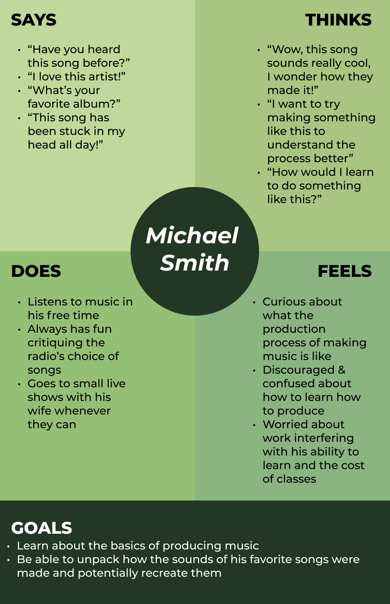
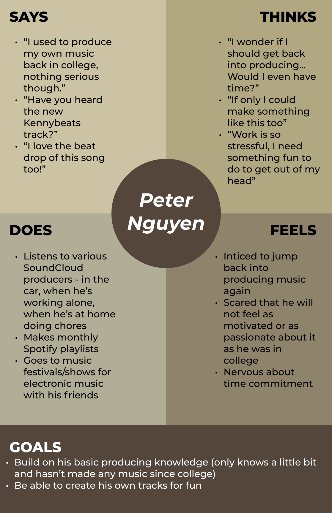
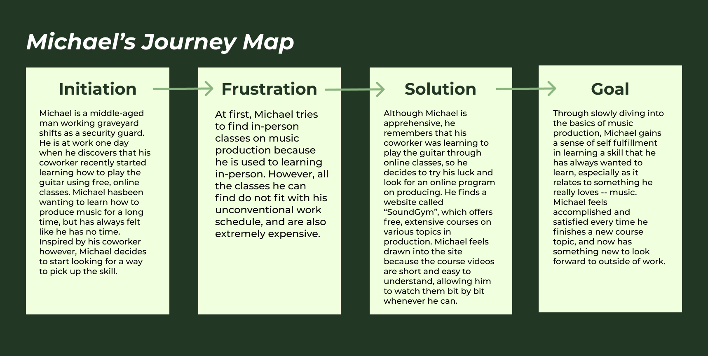
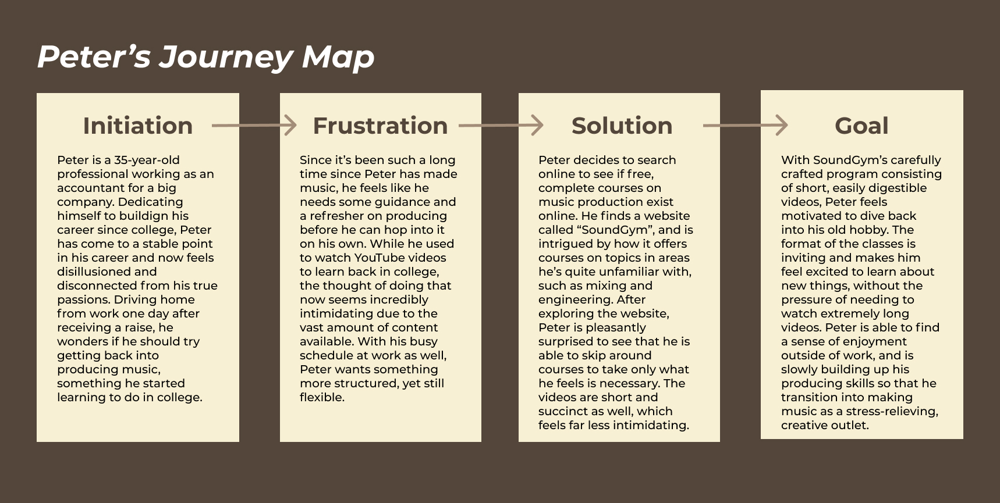

#### Assignment 04: UX Storytelling
# Personas, Empathy Maps, and Scenarios
Daisy Kwok | DH 110 User Experience and Design | Spring 2022

## The Purpose of UX Storytelling
With UX Storytelling, and personas more specifically, we are able to insert ourselves into the perspective of the user to better understand their needs, wants, and goals. By stepping into the worldview and lifestlye of the user, we can begin to shed ourselves of our own biases and ways of thinking, and instead approach scenarios the way our users would. Below are two personas that I've created to enter into the mindset of the average user who wants to learn how to produce music. 

## Personas & Empathy Maps
### Persona 1: Michael Smith

### Persona 2: Peter Nguyen

## Scenarios & Journey Maps
### :one: Michael's Scenario & Journey Map
**Why is Michael using this product?**
> After clocking out of work in the morning, Michael stops to chat and catch up with his coworker James. They bond over how, with all their kids no longer living with them, they are now “empty nesters”. James reveals that he’s been trying to learn how to play the guitar using free online classes, which sparks a new idea in Michael’s mind. Michael has loved music all his life and has been curious about what it’s like to produce music. He’s always felt like he’s been too busy with work and taking care of his kids to learn how to make music, and that learning would be too costly. But now, with his coworker sharing that he is also delving into a new hobby, Michael feels like it could be possible. He asks James what site he’s learning from, and James reveals that while the site he’s using only offers courses on guitar, he’s sure that if Michael searches online for free music producing classes, he’ll be able to find something.After clocking out of work in the morning, Michael stops to chat and catch up with his coworker James. They bond over how, with all their kids no longer living with them, they are now “empty nesters”. James reveals that he’s been trying to learn how to play the guitar using free online classes, which sparks a new idea in Michael’s mind. Michael has loved music all his life and has been curious about what it’s like to produce music. He’s always felt like he’s been too busy with work and taking care of his kids to learn how to make music, and that learning would be too costly. But now, with his coworker sharing that he is also delving into a new hobby, Michael feels like it could be possible. He asks James what site he’s learning from, and James reveals that while the site he’s using only offers courses on guitar, he’s sure that if Michael searches online for free music producing classes, he’ll be able to find something.

**How is Michael using this product?**
> That weekend, Michael uses the old desktop computer that he shares with his wife to look up free online programs for learning to produce, and finds a website called SoundGym. Excited at the prospects, Michael creates an account and jumps right into the initial activation activities, where he is evaluated on his listening skills. Michael is immediately hooked in through these engaging activities. After completing them, he selects “Electronic Music Production” as his course topic an is delighted to see that the program is quite detailed and is organized into sub topics, each with an extensive list of free course videos. Michael begins watching the first few videos, and is happy to see that the website tracks his progress, so that he can always find where he left off on. The videos are also not too long, so the information is easy to digest. 
> 

### :two: Peter's Scenario & Journey Map
**Why is Peter using this product?**
> Peter is driving home after work, feeling tired yet fulfilled because he’s just been given a raise at work. Although he feels proud of this accomplishment, he also feels like something is missing from his life. With the music playing loudly from his car speakers, Peter’s mind drifts off to when he was first learning how to produce music in college, a hobby that was short lived as he focused more on building his career. With his career becoming more and more stable, Peter wonders if he should jump back into producing. However, it’s been years since he last made any music, so he’s worried that he won’t remember much and will feel discouraged from regularly practicing the craft, and ultimately end up quitting again. He considers watching YouTube videos to start, but the number of videos out there feels quite overwhelming. 

**How is Peter using this product?**
> That night, Peter goes online to search for a free online program that he can take to get back into music production. He stumbles across a website called SoundGym, and is surprised to find that it focuses specifically on producing and other related topics such as mixing and engineering -- things that he has never learned. Intrigued, Peter makes an account and goes through the set-up process, where he is taken through several listening evaluation activities. Once he enters into the main page, he selects the “Electronic Music Program” topic. There, he sees that the course begins with extremely basic information about home studio equipment -- things he definitely remembers. Thankfully, he is able to skip those courses and continue onto video courses on topics he is unfamiliar with. Because Peter already has some background knowledge on producing, he appreciates the flexibility and structure of the website and decides to continue taking small courses in his free time to slowly dive back into producing. 

