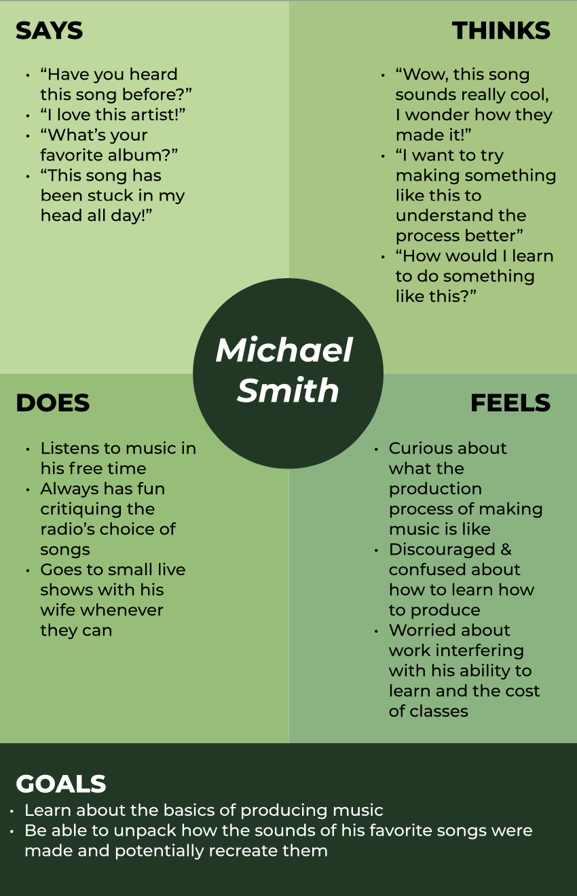
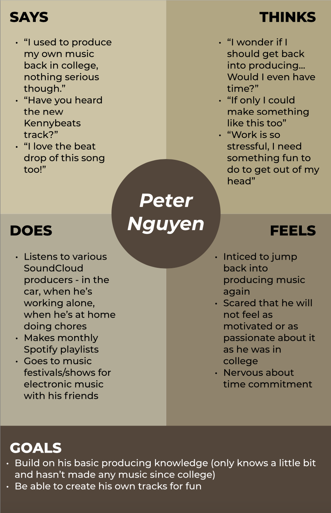

#### Assignment 04: UX Storytelling
# Personas, Empathy Maps, and Scenarios
Daisy Kwok | DH 110 User Experience and Design | Spring 2022

## The Purpose of UX Storytelling
With UX Storytelling, and personas more specifically, we are able to insert ourselves into the perspective of the user to better understand their needs, wants, and goals. By stepping into the worldview and lifestlye of the user, we can begin to shed ourselves of our own biases and ways of thinking, and instead approach scenarios the way our users would. Below are two personas that I've created to

## Personas & Empathy Maps
### Persona 1: Michael Smith

### Persona 2: Peter Nguyen

## 

