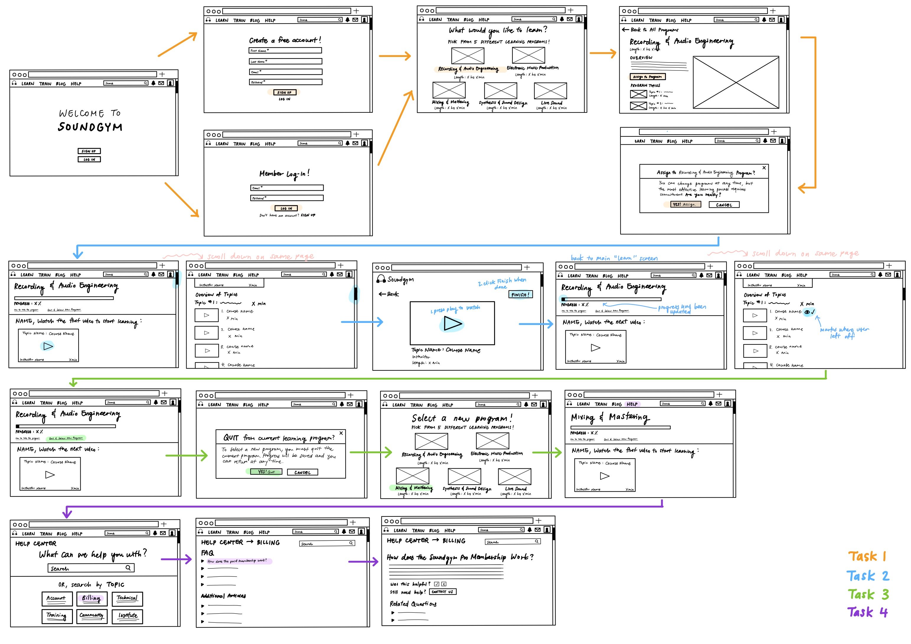
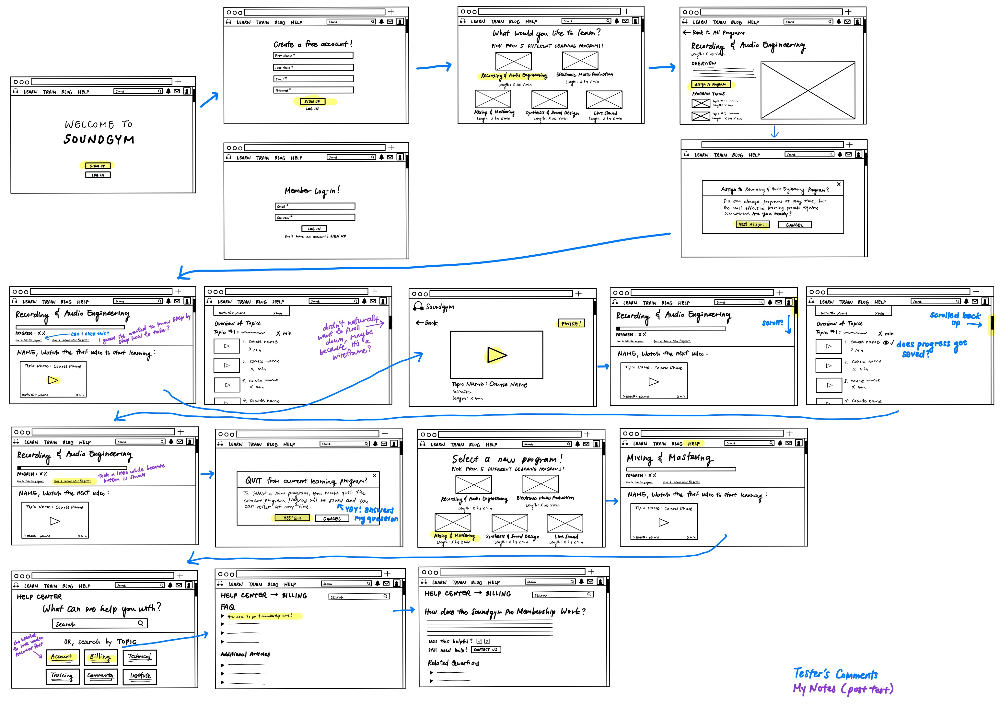

#### Assignment 04: UX Wireframe/Paper Prototype
# Low Fidelity Prototype
Daisy Kwok | DH 110 User Experience and Design | Spring 2022

## Overview 
### About the Project
This project aims to simplify the process of using a free online course to learn how to produce music. Focusing on the website SoundGym, this low fidelity prototype redesigns certain features to streamline the learning experience, so that users of all backgrounds can easily navigate through the site to accomplish their unique goals with as little complications or confusion as possible.  

Previously, I developed two different personas to get a better understanding of the wants, needs and goals of the average user within the target audience. The first persona is Michael, a married, older man who works unconventional graveyard shifts as a security guard. He has no background knowledge about music production but loves music itself, and has always wanted to learn. Michael's goal is to find a free and straightforward way to learn about music production in small sessions that he can take whenever he has free time. The second persona is Peter, a single, middle-aged man who briefly learned how to produce music in college. He is very busy with his career as an accountant for a big company, but wants to get back into his old hobby. Like Michael, Peter also prioritizes the flexibility of being able to start and stop courses whenever he wants, so that he can learn whenever he has time out of his busy schedule. Because he already has some background knowledge about producing, he also values flexibility in terms of being able to skip past the courses he already feels familiar with.

### Purpose of Low Fidelity Prototyping
Low fidelity prototyping is a low-cost method of designing and testing the usability of the features in a product (as well as how they are organized). The prototype outlines the flow of the features and how the user might navigate through them, without placing too much emphasis on appearances. Through low fidelity prototyping, the designer can guage the ease of use for the features of the product. 

## Tasks 
This low fidelity prototype supports the following tasks, based on the presumed basic needs of the target audience:
1. Onboarding (sign up/log in) + commiting to a learning program
2. Watching course videos
3. Switching to a different learning program
4. Navigating the help center to find information about a specific question (information about the pro membership) 

## Wireframes & Wireflow

## Testing the Wireflow

Although the tester was able to successfully complete all of the tasks, there were some things that did surprise me. For example, for Task 2 (watching course videos), instead of immediately clicking the play button on the course video, the tester was curious about the "How to take the program" button that I included. I included that button as it was a feature I wanted to explore but I did not fully create it for the wireframe/wireflow, so it was not possible for her to actually "click" it and go into that feature. For Task 3 (switching to a different learning program), the tester still took a minute to find the correct button, but she was able to locate it much quicker than my interviewee from my pilot UT. It was clearly labeled as "Quit & select new program", but perhaps it needs to be larger/more visually apparent. Lastly, for Task 4 (finding more info about the paid membership in the help center), the tester initially clicked on the wrong FAQ topic, likely because I didn't fully list out questions that the topic may cover under the title (which the actual website does).

## Reflection
