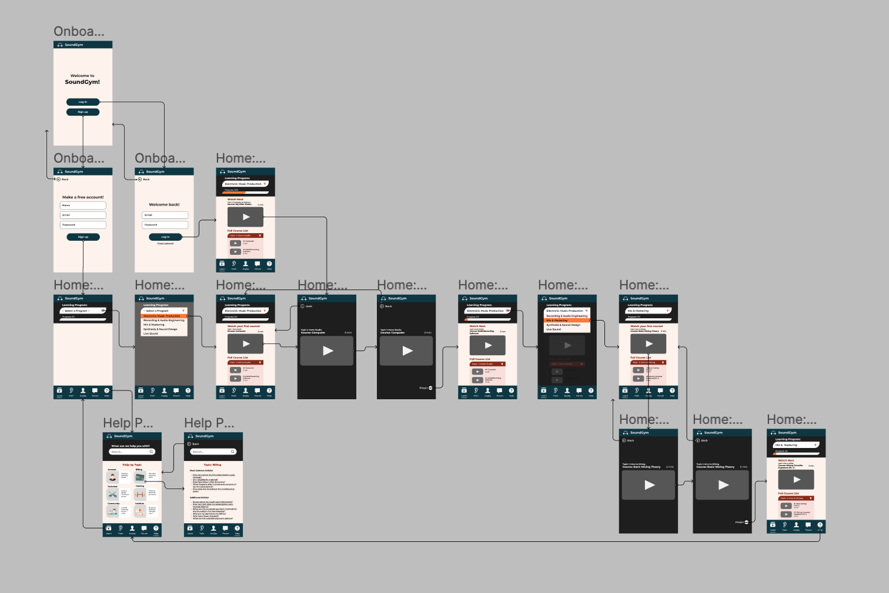
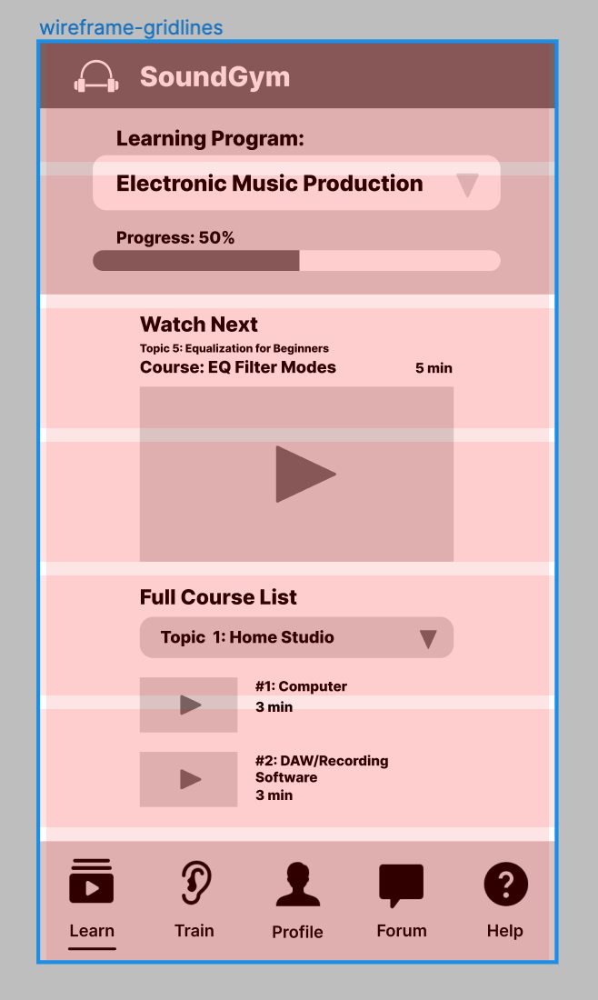

#### Assignment 06
# Interface Design
Daisy Kwok | DH 110 User Experience and Design | Spring 2022

## Introduction
My project aims to provide a simple way of taking free online courses to learn about music production, using SoundGym as the website I aim to improve. After reflecting on previous user tests, the goal for this initial interface design was to focus on the most-used features of watching course videos, switching between programs, and navigating the help center. Additionally, with the completion of my initial low-fidelity wireframe, I decided to switch gears and redesign the platform for mobile devices rather than for desktop users. Users of mobile apps are familiar with the typical lower screen menu bar with four to five icons/tabs. For this interface design, I have included five different tabs in the menu bar, but currently only the "Learn" and "Help" tabs are fully fleshed out, based on the features and functions I decided to focus on.

For this interface design, I developed a custom design style for the mobile version of SoundGym, inspired by the original website's color palette and overall aesthetic. The process of creating the design was as follows: 

1. Redesign wireframe for mobile (done on Figma)
2. Picking a layout using Figma's grid system
3. Testing several variations of fonts, shapes, and color palettes
4. Checking color accessibility (done with the Stark plugin)
5. Conducting an impression test

## Digitized Workflow
My digitized workflow can be accessed [here](https://www.figma.com/file/QQxuoj7YEjoPALaa4j4Nup/DH-110%3A-a06-(Low-Fidelity-Prototype)?node-id=0%3A1). 

My interface design is based on an iPhone 8 screen. Due to the small size of the screen compared to the amount of information the program aims to provide, I decided on a grid system of 1 column (5px margin, 5px gutter) and 7 rows (0px margin, 10px gutter). 

## Graphical Interface Design Variations
For the following tests for fonts, shapes, and colors, I used the the screen titled "Home: Learn-Resume", as I felt that that screen contained a lot of content and elements to experiment with.

### Typography 

### Shape

### Colors
