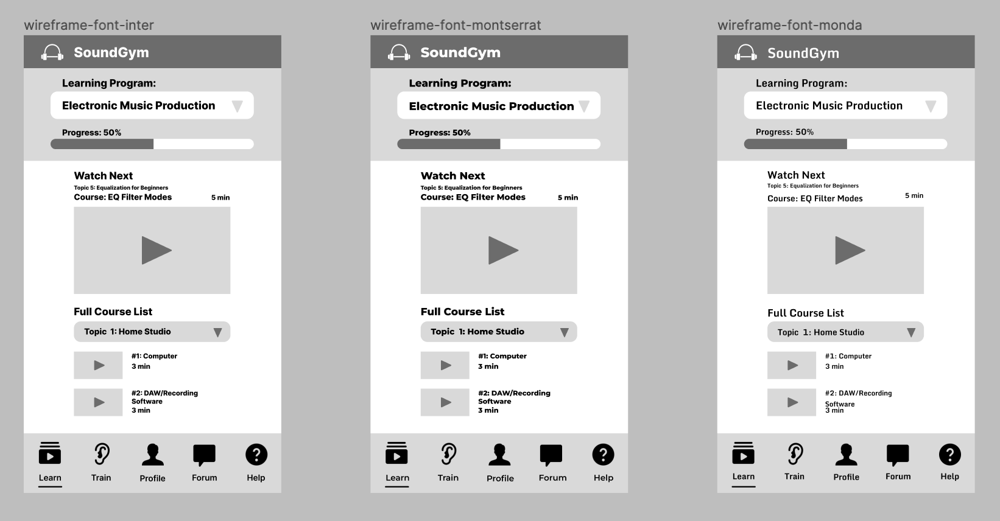

#### Assignment 06
# Interface Design
Daisy Kwok | DH 110 User Experience and Design | Spring 2022

## Introduction
My project aims to provide a simple way of taking free online courses to learn about music production, using SoundGym as the website I aim to improve. After reflecting on previous user tests, the goal for this initial interface design was to focus on the most-used features of watching course videos, switching between programs, and navigating the help center. Additionally, with the completion of my initial low-fidelity wireframe, I decided to switch gears and redesign the platform for mobile devices rather than for desktop users. Users of mobile apps are familiar with the typical lower screen menu bar with four to five icons/tabs. For this interface design, I have included five different tabs in the menu bar, but currently only the "Learn" and "Help" tabs are fully fleshed out, based on the features and functions I decided to focus on.

For this interface design, I developed a custom design style for the mobile version of SoundGym, inspired by the original website's color palette and overall aesthetic. The process of creating the design was as follows: 

1. Redesign wireframe for mobile (done on Figma)
2. Picking a layout using Figma's grid system
3. Testing several variations of fonts, shapes, and color palettes
4. Checking color accessibility (done with the Stark plugin)
5. Conducting an impression test

## Digitized Wireflow
My digitized workflow can be accessed [here](https://www.figma.com/file/QQxuoj7YEjoPALaa4j4Nup/DH-110%3A-a06-(Low-Fidelity-Prototype)?node-id=0%3A1). This file is where I also experimented with different interface design variations. 

## Screen Design Variations
For the following tests for fonts, shapes, and colors, I used the the screen titled "Home: Learn-Resume", as I felt that that screen contained more content and elements to experiment with compared to the initial onboarding screen. 

### Typography 

I tested out three different fonts: Inter, Montserrat, and Monda. All three of these fonts are sans serif-fonts, which are easier to read on digital screens.

### Shape

For the "Home: Learn-Resume" screen, I experimented with different variations for the shapes of the drop down menus, progress bar, and video thumbnails. For the drop down menus and progress bar, I tested sharp corners, two variations of rounded corners, and one variation where only two corners were rounded. After comparing the four variations, I felt that the version with two corners rounded gave the app a more modern feel and stood out as a unique design choice that users could associate with the app. For the video thumbnails, the rounded edges also contributed to a more modern look and helped the page look more dynamic, so I went with rounded corners rather than straight corners for the videos thumbnails.

For the "Onboarding" screen where a different set of buttons are included, I tested three types: straight corners, rounded corners, and mixed. Although the mixed version with only two corners rounded worked well for the drop down menu, I felt that rounding out the edges for all four corners of the button made more sense and would be what users are more used to seeing. 

### Colors

I generated this color palette by bringing a screenshot of a page on SoundGym into Adobe Color. I wanted to keep the color palette of the mobile version consistent with the colors used on the website, so that while the mobile version is a redesign, the colors will enable users to maintain a sense of familiarity with the platform. 
  

Featured above are several different color variations that I developed. I felt that "Color 2" was the variation that was most visually appealing, so I focused on that color palette when creating a dark mode version. 

## Accessibility Testing for Color Contrast
Below are my tests for accessibility, focusing on color contrast in light and dark mode.

### Light Mode

 
 
 

### Dark Mode
 
 

## Final Design System

Above is the interface design that I went with.  

### Layout Grid

My interface design is based on an iPhone 8 screen. Due to the small size of the screen compared to the amount of information the program aims to provide, I decided on a grid system of 1 column (5px margin, 5px gutter) and 7 rows (0px margin, 10px gutter). 

### Typeface Family & Sizes
While I initially contemplated mixing font styles (ex: Monda for headings and Montserrat for regular body text), I ultimately decided to use one font for all the text because the content felt quite cluttered and busy when I attempted to combine them. To create distinction between different content sections, I created the following text styles in Figma: 

Logo Text: Montserrat, Extra Bold, 20pt.  
Heading 1: Montserrat, Bold, 20pt.  
Heading 2: Montserrat, Bold, 12pt.  
Body Text: Montserrat, Semi Bold, 10pt.  
Dropdown Text (Large): Montserrat, Semi Bold, 16pt.  
Dropdown Text (Medium): Montserrat, Semi Bold, 12pt.  
Button 1: Montserrat, Bold, 16pt.  

### Color Scheme

Above is the color palette that I decided to go with, in both light and dark modes. This palette passed most of the accessibility requirements with the exception of the orange on black section of the progress bar for the AAA level. I was fairly satisfied with how this color variation looked, so below is a screenshot of my final color styles in Figma. 

## Impression Test
Below are some insights from an impression test with my interviewee. 

**On Type**
- She liked the Monda font the most
- When asked why, she explained that it was the font that was easier to read for her 
- "It looks more sleek in my opinion."

**On Shapes**
- For the drop down menu, she liked the slightly rounded option because it felt like a happy medium between sharp corners and fully rounded
- She also liked the drop down menu that mixed sharp and round corners
- For the progress bar, she preferred the version with rounded edges
- She also preferred rounded edges for the video thumbnails 
- "It feels familiar because of the YouTube app logo, so it helps that there's symbol recognition."

**On Color**
- Overall, she liked the color palette that was used
- She felt that the combinion of colors was pleasant: the contrast was good and the colors themselves were simultaneously muted/not too bright while also being distinct and noticeable
