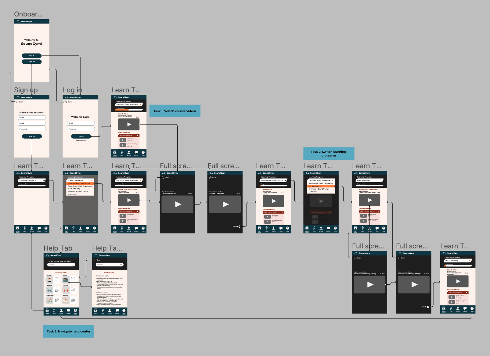

#### Assignment 07: Interactive Prototype
# High Fidelity Prototype

Daisy Kwok | DH 110 User Experience and Design | Spring 2022

## About the Project
This project aims to provide a simple way of taking free online courses to learn about music production, using SoundGym as the website to be improved and refined as a mobile app. The main function of SoundGym is to be able to watch course videos about producing music, so my project focuses on how to streamline that experience of watching courses and selecting learning programs. 

I used Figma to create this high fidelity prototype, which was built upon a low-fidelity protype from the previous project step. The purpose of this high fidelity prototype is to test out the functionality of the revised app's graphical design interface. The interactive element of the protype allows for it to be tested by a user hands-on, so that I can evaluate whether or not the user can complete the specified tasks of the project and follow the intended flow. 

## Prototype Tasks
Based on the personas developed in previous stages, this high fidelity protype supports the following tasks: 
- Watching course videos 
  - From the perspective of a new user
  - From the perspective of a user resuming a learning program
- Switching between learning programs 
- Navigating the help center

## Wireflow
Pictured below is my wireflow with interface design: 

The Figma file for the wireflow can be accessed [here](https://www.figma.com/file/6snHH9dVo3eBEgYDhCdDGg/DH-110%3A-a07-(High-Fidelity-Prototype---WIREFLOW)?node-id=0%3A1).

## Interactive Prototype
The interactive prototype can be accessed [here](https://www.figma.com/proto/ekDJNwRUUppRdcFO94z0Yr/DH-110%3A-a07-(High-Fidelity-Prototype---Interactive-Ver.)?node-id=8%3A8&scaling=scale-down&page-id=0%3A1&starting-point-node-id=8%3A8). The Figma file for this prototype can be viewed [here](https://www.figma.com/file/ekDJNwRUUppRdcFO94z0Yr/DH-110%3A-a07-(High-Fidelity-Prototype---Interactive-Ver.)?node-id=0%3A1).

## Cognitive Walkthrough
### In-Class Group Activity
We were alloted time during class to conduct a cognitive walkthrough in groups. My high fidelity interactive prototype was not complete at that point in time, so I took my groupmates manually through my wireflow instead. The first screen at that stage of the prototype was on the learn tab rather than the onboarding page to sign up/log in. From that first page, both of my classmates were able to infer what the app was about (music production). Overall, they felt that the graphical design of the app made it easy to understand what the application is for and what buttons they should click to complete certain actions (such as watching videos, going back one page, etc.). Perhaps due to the fact that they couldn't physically interact with the prototype themsevles, they felt that there were no points in the wireflow where they felt confused and unsure about what to do next.

### Second Cognitive Walkthrough
After making the high fidelity protype interactive, I conducted another cognitive walkthrough with another individual (age 22, female). 

#### First Impressions
With this version of the prototype, the first screen is now on the onboarding page. When asked what she thought the app was about, she actually thought that it would be something more like Spotify where users can play music, due to SoundGym's headphone-shaped logo. This was quite far off from its actual purpose of helping users learn to produce music, so I will consider adding a brief description to that onboarding page that will cue users in on what to expect from the app. 

#### Completion of Tasks
Keeping in mind that the user is not within the target age range, the user was able to successfully complete all three tasks without any major obstacles. After "logging in" as a returning account, the user felt that they could clearly see the previous progress made in the courses and could assume that the videos are listed in a suggested, chronological watch order. 

Task 1 of watching course videos was easy and intuitive to the user. The user also felt that Task 2 of switching learning programs was easy because the drop down menu for selecting a new learning program was clearly labeled. The user felt that it was pretty self-explanatory how to complete the task, and was able to proceed and watch more course videos without being prompted to. Finally, they also successfully completed Task 3 of finding the help tab and navigating it to find information about billing. They felt that things were clearly labeled so it didn't require a lot of effort to search deeply for those items. 

#### Overall Thoughts
Overall, the user was able to quickly complete all three tasks. They noted that the steps to complete these tasks feel familiar to interactions of other online platforms. When asked about the graphical design, they praised the color palette for being minimalistic and easy on the eyes while still contributing to the organization/layout of the screen. Unlike the previous stage of low fidelity prototyping where my interviewee preferred a different font from what I used, the interviewee for this cognitive walkthrough had no comments on the typography of the design. She also did not feel that there was anything particularly confusing, and emphasized again that the menu tabs were clearly labeled and pointed towards what the user should do next.
